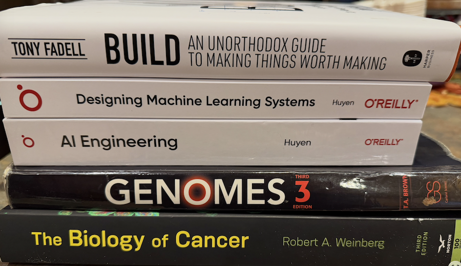

# Cancer-Computational-Biology-Notes-And-Code_Review-And-Read-Ahead_2025-2026

weekend/extra reviewing/studying
papers, code, notes on sequencing, SVs, databases, pipelines
self note: prolly should just write the definition the day of, but weekends are also ok i guess

# Goals
## Nov-Dec 2025
* make a study calendar, review everything that i think i need to review that i wrote/writing about
* 1st week Dec - memorize the 20 amino acids (just get it out of the way), use to know them, need to just memorize them now (anki)
* put the youtube videos/seminars/lectures in their named playlist (e.g. "orgo" or "rust" or "python" or "AI" or "cancer") so the recommendations keep recommending the good stuff (i think that helps)
* etc etc will think of more things to keep myself busy
* i could probably find a biochemistry undergrad class on youtube and watch the lectures at 2x or 3x the speed to review things

# Solid tumors
<< a table of some sorts here >>

# Papers
tags: `#immunesignatures` `#rnaseq`
- [ ] [2020 - RNA Immune Signatures from Pan-Cancer Analysis Are Prognostic for High-Grade Serous Ovarian Cancer and Other Female Cancers](https://www.mdpi.com/2072-6694/12/3/620) `#immunesignatures` `#rnaseq`
* [2025 - Limited Role of Microbes in Cancer Suggested by Pan-Cancer Genomic Studies](https://www.genomeweb.com/cancer/limited-role-microbes-cancer-suggested-pan-cancer-genomic-studies)

<!-- words that come up that i mostly know to define/look into **soon** like over the weekends?? making a dictionary for myself for the future -->
<!-- my study plan: understand and memorize each section every week, find papers on the topic throughout the week to understand even further, add to it throughout the work week. -->

# 1. Mutation Types and Genomic Alterations

# Truncating mutation
* Functionally, these types of mutations are usually severe as they cause a premature stop signal in the mRNA -> loss of function events. 
* “In cancer biology, truncating mutations in tumor suppressors follow Knudsen's two-hit hypothesis. Since we inherit two copies of each gene, both copies typically need to be inactivated for cancer to develop. A truncating mutation provides one "hit," and if the other allele is lost through deletion, mutation, or epigenetic silencing, the cell loses that tumor suppressor function entirely.”
* “you'll typically see them annotated with specific nomenclature. For example, p.R213* indicates an arginine at position 213 changed to a stop codon, while p.V234fs indicates a frameshift starting at valine 234.”
Frameshift mutations. 
* Shifts the reading frame of the genetic code: nucleotide is inserted or deleted from the DNA sequence in numbers that aren’t multiples of three -> disturbs reading pattern
* Frameshift mutations almost always lead to truncated proteins. “When the reading frame shifts, the likelihood of encountering a stop codon in the new frame is quite high – statistically, you'd expect to hit one within about 20 codons just by chance. This is because three of the 64 possible codons are stop signals.”
* “When you see a frameshift in TP53 or APC, you can be confident that the protein has lost its tumor-suppressing function.”
* “Cells have evolved mechanisms to deal with frameshifted transcripts. The nonsense-mediated decay pathway recognizes mRNAs with premature termination codons (which frameshift mutations usually create) and degrades them. This quality control prevents the production of aberrant proteins, but it also means the gene product is completely absent – effectively a null mutation.”
* The standard nomenclature uses "fs" to indicate a frameshift. For example, "p.V600Efs*15" tells you that at amino acid position 600 (a valine in the normal protein), a frameshift begins due to a deletion of one nucleotide (E stands for glutamic acid in the single-letter code, but this is what the new frame would encode). The "*15" indicates that the new reading frame continues for 15 amino acids before hitting a stop codon.

## Missense.
* Point mutation that changes a single nucleotide in the sequence -> codon that encodes a different amino acid
* More subtle than previous two mutation types
* “Unlike truncating mutations that typically cause loss of function, missense mutations can do three different things: they can inactivate the protein (loss of function), they can have no effect (neutral), or – and this is where it gets really interesting – they can actually enhance or alter the protein's function (gain of function).”
* “Gain-of-function missense mutations are especially important in oncogenes. Take BRAF V600E, one of the most common mutations in melanoma. The substitution of valine with glutamic acid at position 600 locks the BRAF kinase in an active conformation, causing constitutive activation of the growth-promoting MAPK pathway. This single amino acid change transforms a normally regulated protein into a cancer driver.”
* “The position of a missense mutation within the protein structure often determines its impact. Mutations in the active site of an enzyme, at protein-protein interaction interfaces, or in regions critical for protein stability tend to have stronger effects. Conversely, mutations on the protein surface away from functional domains might be well-tolerated. This positional effect creates "hotspots" and "coldspots" for cancer-causing mutations. In TP53, for instance, six specific codons (175, 245, 248, 249, 273, and 282) account for nearly 30% of all mutations in human cancers. These positions are critical for DNA binding or protein stability, so mutations here effectively disable TP53's tumor suppressor function.”
* “The interpretation becomes even more complex when considering context. A missense mutation might be benign in one tissue but pathogenic in another, depending on expression levels, interaction partners, or cellular environment. Some mutations only reveal their effects under stress conditions or in combination with other genetic alterations.”
* When you encounter missense mutations in your analyses, you'll see them annotated with standard nomenclature like "p.V600E" – indicating that valine (V) at position 600 is replaced by glutamic acid (E). The challenge lies not in identifying these mutations, but in determining their functional significance. Is this mutation driving the cancer? Will it affect drug response? These questions often require integrating multiple lines of evidence – from evolutionary conservation to structural modeling to clinical correlations.”

# Splice mutations/alteration
* A splice mutation is a genetic alteration that disrupts the normal splicing of pre-mRNA into mature mRNA, potentially causing exons to be skipped, introns to be retained, or cryptic splice sites to be activated.
* In cancer biology, splice mutations can have profound effects. Take the tumor suppressor gene STK11, where splice mutations are common in lung cancer. Some of these mutations cause exon skipping that removes the kinase domain, completely inactivating the protein. Others might produce partially functional proteins with altered regulation.
* The therapeutic implications of splice mutations are evolving rapidly. Some splice mutations create novel epitopes that could be targeted by immunotherapy. Others might be corrected by antisense oligonucleotides that mask cryptic splice sites or enhance correct splicing. Understanding exactly how a splice mutation affects the transcript is crucial for these therapeutic approaches.

## In-frame deletion.
* An in-frame deletion is a deletion of nucleotides from the DNA sequence where the number of deleted bases is a multiple of three, thus preserving the reading frame of the genetic code.
* “This variability makes in-frame deletions particularly interesting in cancer biology. Unlike frameshift mutations, which almost always destroy protein function, in-frame deletions can have a spectrum of effects. They might remove a regulatory domain while leaving the catalytic domain intact, creating a constitutively active protein. Or they might delete a degradation signal, causing the protein to accumulate abnormally. These aren't just loss-of-function events – they can create proteins with altered, sometimes oncogenic, properties.”
* “A classic example in cancer is the EGFR gene in glioblastoma. In-frame deletions in exons 2-7 create the EGFRvIII variant, which lacks part of the extracellular domain. This deletion removes the ligand-binding region but preserves the kinase domain, resulting in a receptor that's constitutively active without needing its normal activating signal. It's a perfect illustration of how removing amino acids can paradoxically increase protein activity.”
* “In lung cancer, in-frame deletions in EGFR exon 19 are among the most common activating mutations. These deletions typically remove four to six amino acids around the LREA motif in the kinase domain. The shortened protein has increased kinase activity and, crucially, enhanced sensitivity to EGFR inhibitors like erlotinib and gefitinib. This shows how in-frame deletions can be both oncogenic drivers and therapeutic targets.”
* “The annotation typically shows both the nucleotide change and the protein consequence, like "p.E746_A750del" indicating amino acids 746-750 (glutamic acid through alanine) are deleted.”
* “you might also encounter compound events where an in-frame deletion is accompanied by an insertion – we call these "indels." As long as the net change in nucleotides is divisible by three, the reading frame is preserved. For example, deleting six nucleotides and inserting three would maintain the frame while replacing two amino acids with one new one.”

## Inframe indel.
* An inframe indel is a complex mutation where nucleotides are both deleted and inserted at the same location, with the critical feature that the net change in base pairs is divisible by three, thus preserving the downstream reading frame.
* “In cancer biology, inframe indels can have particularly nuanced effects. Unlike frameshift mutations that typically destroy protein function entirely, inframe indels can create gain-of-function mutations, alter protein specificity, or change regulatory properties. They're like precision edits that modify specific protein features while keeping the overall architecture intact.”
* “A striking example occurs in the KIT gene in gastrointestinal stromal tumors (GISTs). Inframe indels in exon 11 often delete portions of the juxtamembrane domain while inserting different amino acids. These mutations remove an autoinhibitory region, leading to constitutive kinase activation. What makes this clinically fascinating is that different indels in the same region can have different drug sensitivities - some respond well to imatinib, while others confer resistance.”
* “The standard notation attempts to capture this complexity, such as "p.D579_H580delinsGY", which indicates that aspartic acid 579 and histidine 580 are deleted and replaced with glycine and tyrosine.”
* “When analyzing the functional impact of inframe indels, you need to consider several factors beyond just counting amino acids. First, what's the structural context? Replacing amino acids in a flexible loop might be tolerated, while the same change in a rigid alpha helix could be devastating. Second, are critical residues affected? Deleting a phosphorylation site while inserting other amino acids might completely alter protein regulation. Third, does the indel affect domain boundaries? Sometimes these mutations can shift domain interfaces in ways that alter protein-protein interactions.”

# Amplification
* An amplification is a type of genomic alteration where a segment of DNA is abnormally duplicated, resulting in multiple copies of genes within that region.
* The key insight about amplification is that it achieves oncogenic activation through abundance rather than alteration.
* “There are several ways amplification can occur at the chromosomal level, and understanding these mechanisms helps explain why certain genes are prone to amplification. The first mechanism involves breakage-fusion-bridge cycles. When a chromosome loses its protective telomere ends, it becomes "sticky" and can fuse with other broken chromosomes. During cell division, this fused chromosome gets pulled in both directions, breaks again, and the cycle repeats. Each cycle can duplicate the genes near the breakpoint, leading to massive amplification.”
* “The scale of amplification can vary dramatically, and this has important functional consequences. Low-level amplification might involve 3-10 copies and could result from whole-arm or whole-chromosome gains. High-level amplification can reach 50 or more copies and usually involves more focal events. The distinction matters because different mechanisms tend to produce different patterns of amplification, and the degree of amplification often correlates with clinical outcomes.”
* “In cancer biology, certain genes are recurrently amplified across tumor types, and understanding why reveals important principles about oncogenesis. The MYC oncogene is perhaps the most frequently amplified gene in human cancers. When amplified, cells produce excessive amounts of the MYC transcription factor, driving proliferation and blocking differentiation. What makes MYC amplification particularly potent is that MYC regulates thousands of downstream genes, so its overproduction has cascading effects throughout the cell. ERBB2 (also known as HER2) amplification in breast cancer provides a perfect example of how understanding amplification can transform patient care. About 20% of breast cancers have ERBB2 amplification, leading to massive overproduction of this growth factor receptor. Before we understood this, these patients had poor prognoses. But recognizing that the problem was too much normal ERBB2 protein led to targeted therapies like trastuzumab (Herceptin) that specifically block the excess receptors.”
* “An important consideration in interpreting amplifications is distinguishing driver genes from passengers. A single amplification event might encompass dozens of genes, but typically only one or a few actually contribute to tumorigenesis. The others are simply "along for the ride." Functional studies, expression analysis, and cross-tumor comparisons help identify the critical targets.”
* “The clinical implications of amplification extend beyond just diagnosis. Amplified genes can be excellent therapeutic targets because cancer cells often become addicted to their overexpression. This addiction creates a therapeutic window – blocking an amplified gene might devastate cancer cells while having minimal effect on normal cells with only two copies. However, amplification also contributes to drug resistance through a disturbing mechanism. When cancer cells are exposed to drugs targeting an amplified gene, they can sometimes amplify it even further, producing so much target protein that reasonable drug doses can't inhibit it all. This escalation resembles an arms race between treatment and tumor evolution.”

## Deep deletion.
* “A deep deletion, also called a homozygous deletion, is the complete loss of both copies of a genomic segment, resulting in zero copies of the affected genes. This is fundamentally different from the typical mutations we've discussed because it represents the absolute absence of genetic material rather than its alteration.”
* “The mechanisms that generate deep deletions reveal why certain genomic regions are particularly vulnerable. One common pathway involves sequential losses. A cell might first lose one copy of a gene through a large deletion or chromosome loss. If that cell later experiences a second deletion event affecting the remaining copy, you get a deep deletion. This two-step process is actually quite common in cancer evolution.”
* “Another mechanism involves chromothripsis, a catastrophic event where a chromosome essentially shatters and is then incorrectly reassembled. During this chaotic reconstruction, some pieces are lost entirely. If both copies of a gene happened to be on the affected chromosome regions, they can both be lost in one dramatic event. This helps explain why some cancers show multiple deep deletions clustered in specific chromosomal regions.”
* “What makes deep deletions particularly important in cancer biology is their irreversibility and completeness. While a point mutation might be compensated for by increased expression from the wild-type allele, or a heterozygous deletion might be tolerated through dosage compensation, a deep deletion leaves no room for adaptation. The gene and its function are simply gone.”
* “But here's where it gets interesting from a therapeutic perspective. Deep deletions create vulnerabilities that might be exploited. The concept of synthetic lethality becomes particularly relevant here. If a deep deletion removes one member of a redundant pathway, the cell becomes absolutely dependent on the remaining pathway members. This dependency can be targeted therapeutically.”
* “For your computational work, detecting deep deletions requires careful analysis of copy number data. In sequencing data, deep deletions appear as regions with essentially no reads mapping to them, but distinguishing true homozygous loss from technical artifacts requires sophisticated normalization. You need to account for mappability issues, where repetitive sequences might falsely appear deleted simply because reads can't be uniquely mapped there. The challenge is compounded by tumor heterogeneity and normal cell contamination. Even if cancer cells have a deep deletion, normal cells in the tumor sample contribute reads from their intact copies. A region might show 30% of normal read depth not because of a heterozygous deletion, but because 30% of cells are normal while 70% have complete loss. Computational methods must deconvolve these mixed signals to accurately call deep deletions.”
* “When you encounter deep deletions in your data, several factors influence their interpretation. The size matters enormously. A deep deletion affecting just CDKN2A is likely a driver event, while a massive deletion removing dozens of genes might be a passenger consequence of chromosomal instability. The key is identifying which genes in the deleted region actually contribute to tumorigenesis.”

## Rearrangement.
* “A rearrangement is a type of genomic alteration where DNA segments are reorganized in abnormal ways - pieces of chromosomes break and rejoin in new configurations, creating novel connections between previously distant genomic regions.”
* “To truly understand rearrangements, we need to appreciate that our genome isn't just a linear string of genes but a carefully organized three-dimensional structure. Genes are positioned relative to their regulatory elements, neighboring genes, and chromosomal landmarks. When rearrangements disrupt this organization, the consequences can be profound and often unexpected.”
* “a fundamental principle that makes rearrangements so impactful: in biology, context is everything. A gene that behaves perfectly normally in its original location can become an oncogenic driver when moved elsewhere.”
* “What makes rearrangements particularly fascinating in cancer biology is their ability to create entirely novel genes through fusion events. When a rearrangement joins parts of two different genes, it can create a fusion protein with properties neither parent gene possessed. This isn't just mixing and matching existing functions - it's creating something genuinely new, often with powerful oncogenic properties. The classic example that revolutionized our understanding of cancer genetics is the Philadelphia chromosome in chronic myeloid leukemia (CML). This translocation between chromosomes 9 and 22 creates the BCR-ABL1 fusion gene. The fusion protein combines BCR's protein-protein interaction domains with ABL1's tyrosine kinase domain, but critically, it loses ABL1's regulatory regions. The result is a constitutively active kinase that drives uncontrolled cell proliferation. What makes the BCR-ABL1 story so compelling is how understanding this rearrangement transformed patient outcomes. Before we knew about this fusion, CML was largely incurable. But recognizing that the disease was driven by a specific abnormal kinase led to imatinib (Gleevec), a targeted therapy that precisely inhibits the fusion protein. Patients who once faced poor prognoses now often achieve long-term remission.”
* “Rearrangements can activate oncogenes through several mechanisms beyond creating fusions. Promoter swapping is particularly clever - a rearrangement might place a normally quiet gene next to a highly active promoter from another gene. Suddenly, a gene that was expressed at low levels is being transcribed constantly. This happens frequently with MYC in Burkitt lymphoma, where translocations place MYC next to immunoglobulin gene promoters that are extremely active in B cells.”
* “The interpretation of rearrangements requires considering multiple factors. First, does the rearrangement create a fusion gene, and if so, is the fusion in-frame and likely to produce a functional protein? Second, does it disrupt important genes at the breakpoints? A rearrangement might simultaneously activate one gene while destroying another. Third, what are the regulatory consequences? Moving genes to different chromosomal neighborhoods can dramatically alter their expression patterns.”
* “Complex rearrangements deserve special mention, particularly chromothripsis and chromoplexy. Chromothripsis involves the catastrophic shattering of one or more chromosomes followed by random reassembly. Chromoplexy features chains of rearrangements that seem to occur in a coordinated fashion. These phenomena challenge our traditional view of cancer evolution as a gradual process and suggest that some cancers might acquire multiple driver alterations in single dramatic events.”
* “A simple translocation might be written as t(9;22), indicating involvement of chromosomes 9 and 22. Fusion genes are often annotated as GENE1-GENE2, with the 5' partner listed first. More detailed annotations might include specific exons involved, like EML4(e13)-ALK(e20), indicating that exon 13 of EML4 is fused to exon 20 of ALK.”

## Fusion
* A fusion, in the context of genomic alterations, is the creation of a hybrid gene formed when a chromosomal rearrangement joins portions of two previously separate genes.
* “A typical fusion combines elements from two genes, which we call the 5' partner (contributing the beginning portion) and the 3' partner (contributing the end portion). Most critically, fusions often combine a strong promoter or regulatory domain from one gene with the functional domain of another, creating proteins that are misregulated, mislocalized, or have entirely novel functions.”
* “The normal ABL1 gene encodes a tyrosine kinase that's carefully regulated - it only becomes active when the cell needs it for specific signaling purposes. The kinase domain is kept in check by regulatory regions within the same protein. When the Philadelphia chromosome translocation occurs, the break in the ABL1 gene happens in a way that preserves the kinase domain but loses much of the regulatory region. This fragment then gets fused to a portion of the BCR gene. What makes this fusion so oncogenic isn't just that it's active - it's that it combines BCR's protein-protein interaction domains with ABL1's kinase activity in a way that creates novel signaling complexes. The fusion protein can phosphorylate targets that normal ABL1 would never encounter, and it does so constitutively because it lacks the regulatory constraints of the original protein. It's not simply BCR plus ABL1; it's an entirely new entity with emergent properties.”
* “The diversity of fusion types reflects the many ways rearrangements can combine genetic elements. In-frame fusions are the most straightforward - they preserve the reading frame so that a full-length fusion protein is produced. These are often the most clinically significant because they create stable, functional proteins. The EML4-ALK fusion in lung cancer exemplifies this, where the coiled-coil domain of EML4 causes the ALK kinase domain to dimerize and activate without its normal ligand.”
* “But fusions can be more subtle than creating obvious hybrid proteins. Promoter fusions occur when a rearrangement places the coding sequence of one gene under the control of another gene's promoter. The TMPRSS2-ERG fusion in prostate cancer works this way - the androgen-responsive promoter of TMPRSS2 drives expression of the ERG transcription factor. The ERG protein itself is normal, but it's being expressed at the wrong time, in the wrong amount, and in response to the wrong signals.”
* “Some fusions create truncated proteins that gain function precisely because they're incomplete. The CRAF fusions seen in some pediatric low-grade gliomas lose the regulatory N-terminal domain of RAF while preserving the kinase domain. Without its built-in brake, the kinase becomes constitutively active. This shows how losing protein domains through fusion can paradoxically increase activity.”
* “Standard nomenclature lists the 5' partner first, like ALK-EML4 would be incorrect - it's EML4-ALK because EML4 provides the 5' portion. More detailed annotations might specify exact breakpoints or exons involved. When analyzing fusion data, pay attention to whether the fusion is in-frame, which exons are included, and whether functional domains are preserved.”

## Tandem duplication
* “A tandem duplication is a genomic alteration where a segment of DNA is copied and the duplicate is inserted immediately adjacent to the original sequence, creating two or more copies arranged head-to-tail like train cars coupled together. This is fundamentally different from the amplifications we discussed earlier, which might scatter copies throughout the genome or create massive copy number increases. Tandem duplications are more precise events that create specific structural changes with unique functional consequences. To visualize this concept, imagine you're editing a document and you accidentally hit copy-paste right next to the original text, so "THE QUICK BROWN FOX" becomes "THE QUICK BROWN THE QUICK BROWN FOX". The duplicated segment immediately follows the original without any intervening sequence. This adjacency is what makes tandem duplications special and distinguishes them from other types of duplications where the copy might land anywhere in the genome.”
* “In DNA sequencing, you'll see increased coverage over the duplicated region, but more importantly, you'll find reads that span the junction between the original and duplicated sequences. This junction is the smoking gun that proves the duplication is truly tandem rather than dispersed. The challenge comes in distinguishing tandem duplications from other events that might create similar patterns. Copy number gains from whole-chromosome duplications increase coverage but don't create novel junctions. Dispersed duplications might create junctions but with intervening sequences.”
* “In terms of annotation, tandem duplications are often described by their size and location. For FLT3-ITD, you might see annotations like "FLT3 ITD 21bp" indicating a 21 base pair insertion, or more detailed descriptions specifying exactly which amino acids are duplicated. The key information includes whether the duplication is in-frame (preserving protein function) and which functional domains are affected.”

## Novel (splicing) event
* “A novel splicing event is an unprecedented pattern of exon joining that creates a transcript variant never before observed in normal cells, resulting in proteins with altered sequences, domains, or regulatory properties. While the splice mutations we discussed earlier focused on how mutations disrupt normal splicing, novel splicing events encompass a broader category - they're about creating genuinely new molecular entities through alternative ways of processing RNA, whether driven by mutations or by dysregulated splicing machinery. To understand what makes a splicing event "novel," let's first consider that even in normal cells, most genes undergo alternative splicing. A single gene might produce dozens of different proteins by including or excluding different exons, using alternative start or stop sites, or retaining certain introns. This normal alternative splicing is carefully regulated and produces known, catalogued isoforms. A novel splicing event, by contrast, creates combinations that don't exist in any normal cell type under any normal condition. Think of it this way: if normal splicing is like following established routes on a map, and splice mutations are like roadblocks that force detours, then novel splicing events are like creating entirely new roads that connect destinations in ways that were never intended. The cell's splicing machinery blazes new trails through the gene, creating transcripts that evolution never designed or tested. Several mechanisms can generate novel splicing events. The most straightforward involves mutations that create entirely new splice sites. A point mutation deep within an intron might create a sequence that looks like a splice acceptor site to the spliceosome. Suddenly, the splicing machinery recognizes this "cryptic" site and includes a piece of intron sequence in the mature mRNA. If this happens to be in-frame, you now have a protein with a completely novel domain inserted in the middle. But here's where it gets particularly interesting for cancer biology - novel splicing events don't always require mutations in the DNA sequence itself. Cancer cells often have dramatically altered expression of splicing factors, the proteins that guide and regulate the splicing machinery. When these regulatory proteins are overexpressed, underexpressed, or mutated, they can cause the spliceosome to make choices it would never make in normal cells.”
* “In cancer evolution, novel splicing events can provide rapid adaptation without requiring DNA mutations. A tumor under therapeutic pressure might upregulate certain splicing factors, generating a diversity of novel protein isoforms. Most might be deleterious or neutral, but if one confers drug resistance or enhanced survival, cells expressing it will be selected. It's like giving cancer cells a toolkit for rapid protein engineering.”
* Novel splicing events also blur the line between coding and non-coding regions of the genome. Sequences that were considered intronic "junk" can suddenly become protein-coding through cryptic splice site activation. Conversely, exons might be skipped in combinations that create novel regulatory RNAs rather than proteins. This expands the functional complexity of the genome beyond what's encoded in the simple exon maps of our genes.”
* “The annotation of novel splicing events in clinical reports requires careful description. You might see terminology like "novel exon 2-4 junction" indicating that exon 2 is being spliced directly to exon 4 in a pattern not seen in normal transcripts. More complex events might be described as "cryptic exon inclusion between exons 7 and 8" or "alternative 3' splice site usage creating novel C-terminus."”
* “When analyzing RNA-seq data for novel splicing events, pay particular attention to recurrent patterns across multiple samples. A novel event seen in many tumors of the same type likely has functional significance, while sporadic events might represent splicing noise or passenger alterations. The challenge lies in determining which novel events are drivers of cancer phenotypes versus inevitable consequences of the dysregulated splicing machinery in cancer cells.”

## Cryptic (splicing) event
* “A cryptic splicing event occurs when splice sites that exist in the DNA sequence but are normally hidden or suppressed become activated, causing the splicing machinery to recognize and use them instead of or in addition to the canonical splice sites. The word "cryptic" here means hidden or concealed - these splice sites were always present in the sequence but remained invisible to the splicing machinery under normal conditions.”
* “To understand what makes these events so fascinating and clinically important, let me first explain why some potential splice sites remain hidden in normal cells. The genome is littered with sequences that resemble splice sites - after all, the canonical splice site consensus sequences are quite short. If the spliceosome recognized every sequence that looked vaguely like a splice site, our genes would be chopped into meaningless fragments. Instead, multiple layers of regulation ensure that only the "real" splice sites are used.
Think of it like walking through a forest where many trees have marks that could be trail blazes, but only some are actual trail markers. Experienced hikers know which marks to follow based on their context, position, and other subtle cues. Similarly, the splicing machinery uses context to distinguish real splice sites from cryptic ones that should be ignored.
What determines whether a potential splice site remains cryptic? Several factors work together. First, the strength of the splice site sequence itself matters - cryptic sites often deviate slightly from the consensus, making them weaker competitors. Second, the surrounding sequence context influences recognition; splicing enhancers and silencers can promote or suppress splice site usage. Third, RNA secondary structures can hide potential splice sites by making them inaccessible. Fourth, the proximity to stronger, canonical splice sites usually dominates the splicing machinery's attention.”
* “Now, here's where it becomes relevant to cancer biology: various alterations can awaken these sleeping splice sites. The most direct mechanism involves mutations that strengthen a cryptic site. A single nucleotide change might convert a sequence that was almost-but-not-quite a splice site into one that the spliceosome readily recognizes. Suddenly, a site that was invisible becomes a beacon attracting the splicing machinery.”
* “A particularly interesting category involves deep intronic cryptic splice sites. These are splice sites hiding deep within introns, far from any exons. When activated, they can cause inclusion of intronic sequence as new exons - we call these "pseudoexons." The CFTR gene in cystic fibrosis provides a classic example, where deep intronic mutations can activate cryptic sites, causing inclusion of intronic sequence that disrupts protein function.”
* “In cancer, cryptic splice activation often contributes to tumor suppressor inactivation. A mutation might not directly destroy a tumor suppressor's function but instead activate a cryptic splice site that causes exon skipping or introduces a frameshift. Understanding these mechanisms is crucial because the protein might be rescuable if we can suppress the cryptic splicing.”
* “The annotation of cryptic splicing events requires precision. You might see descriptions like "activation of cryptic splice acceptor 47bp upstream of exon 8" or "cryptic donor site usage within exon 5 at position c.456+23." These annotations help others understand exactly which hidden splice site has been revealed and what consequences it might have for the protein.”

## Homdels (== "deep deletion")
* "Homdel" is shorthand for homozygous deletion, which is exactly the same concept as the deep deletion we discussed earlier. The cancer genomics community uses these terms interchangeably, and understanding why we have multiple names for the same phenomenon tells us something interesting about how our field has evolved. The term "homozygous deletion" comes from classical genetics terminology. "Homozygous" means having identical alleles at a particular locus - in this case, both alleles are deleted, so you have zero copies of the gene. This terminology emphasizes the zygosity state and connects to how we think about inheritance patterns and Mendelian genetics. When cancer geneticists first started cataloguing these events, this formal genetic terminology was natural to adopt. "Deep deletion," on the other hand, emerged more from the visualization and computational analysis perspective. When you look at copy number plots from array CGH or sequencing data, these deletions appear as deep troughs where the signal drops to zero. The term is more intuitive for describing what you actually see in the data - a deep dive in copy number reaching the bottom.”
* “The abbreviation "homdel" became popular partly because of its use in major cancer genomics databases and analysis pipelines. When you're annotating thousands of variants or writing code to process copy number alterations, shorter terms are practical. You'll see this throughout cancer genomics - we love our abbreviations like "amp" for amplification, "mut" for mutation, and "homdel" for homozygous deletion.”
* “When you see "homdel" in your analyses, remember that this represents the most definitive way to knock out a gene's function. Unlike heterozygous deletions where one copy remains, or mutations that might have uncertain effects, a homdel leaves no ambiguity - that gene's function is completely eliminated in those cancer cells. This clarity makes homdels particularly valuable for understanding which genes are true tumor suppressors and for identifying synthetic lethal relationships that might be therapeutically exploited.”

# 2. Functional Impact Assessment

* Functional effect (mutation does or does not have functional effect)
* Gain of function
* Loss of function (Does the gene tolerate loss of function mutation)
* Deleterious
* Protein stabilization
* Misregulation
* Ubiquitinated
* Driver alteration
* Exon skipping

# 3. Gene and Protein Classification

* Tumor suppressor
* Oncogene
* Oncoprotein
* Context dependent tumor suppressor activity
* Copy number driven genes
* Wild type allele
* Canonical marker genes of tumors
* Specific examples: TP53, MYC, CDKN2Ap14ARF, CDKN2Ap16INK4A

# 4. Experimental Methods and (Clinical) Validation

* ChIP-seq for validation when RNA-seq doesn't give enough information
* RNA-seq to see if alteration was expressed
* Model system in cell line (overexpress the function and mutant)
* Validating expression
* Knockout gene
* Candidate testing
* Long read sequencing (to validate fusions)

# 5. Clinical and Phenotypic Analysis

* Clinical phenotype
* Phenotypic difference
* Survival curve/survival analysis
* Histology
* Primary site
* Actionable targets/actionable mutations
* Cancer types: Sarcoma, Colorectal cancer (CRC)

# 6. Genomic Analysis Concepts

* Allelic expression (what is the other allele doing)
* LOH (Loss of Heterozygosity)
* HETLOSS
* CNLOH
* Clonal vs subclonal
* Biallelic
* MSI (Microsatellite Instability)
* TMB (Tumor Mutational Burden)
* Immune deconvolution
* Recurrent alteration
* Isoform
* Overexpression positivity

# 7. Cancer-centric Databases and Resources

* COSMIC
* OncoKB
* TCGA (associate with phenotype, additional cohorts)
* dbSNP
* gnomAD

# 8. Cancer Biology and Tumor Properties

* Canonical pathway
* Tumor microenvironment
* Cellular plasticity
* Tumor heterogeneity
* Resistance to apoptosis
* Immune evasion
* "It was a clonal event"

# 9. Data Interpretation and Analysis Patterns

* Mutually exclusive vs co-occurring patterns
* Misannotated mutation
* Lowly expressed genes are super variable
* N-terminal path
* Locus
* Basic scientist vs. clinician (perspectives)
* p.X_splice format at MSKCC

# Unsorted Definitions
* __Subclonal__ "In cancer, subclones are __distinct subpopulations of cells within a tumor__ that have different genetic and/or epigenetic characteristics, originating from a common ancestral cell. These subclones can develop through the accumulation of mutations and other changes as cancer cells evolve and adapt to their environment. Understanding subclones is crucial because they can influence tumor behavior, treatment response, and resistance."
* __Clonal Hematopoiesis (CH)__ "Clonal hematopoiesis (CH) happens when a cell called a hematopoietic stem cell, which can develop into different types of blood cells, starts making cells with the same genetic mutation. These blood cells have a different genetic pattern than the rest of your blood cells." [source](https://www.mskcc.org/cancer-care/types/leukemias/risk-factors/clonal-hematopoiesis-ch)
* C to T noise
* Allogenic
* hg38 vs 37 -- deep comparison including mentioning lack of diversity as a reference
* Cell Types (cancer centric)
* B cell
* T cell
* focal changes
* cassette exon
* mislabeling event
* supporting reads
* oversequenced samples in terms of PCA
* isochromosome - https://en.wikipedia.org/wiki/Isochromosome
* RB1
* open on-demand node
* fairshare algorithm
* snapshot
* bot user
* cold vs. warm storage
* haplotype phasing - LRS
* promiscuous mapping
* mmr proteins -> ins/del in homopolymer regions
* "mutationome"
* immune desert
* mutual exclusivity
* evolutionary trajectories
* [long-read sequencing in cancer genomics - reviews and all about it](https://www.nature.com/collections/heffffjebd)

# Etc
* [2008 - On the Process of Becoming a Great Scientist](https://journals.plos.org/ploscompbiol/article?id=10.1371/journal.pcbi.0040033)
* https://www.nature.com/articles/s41598-025-08986-0

# Books (I'm Reading)
* `#BOC` - [The Biology of Cancer](https://wwnorton.com/books/9780393887655)
* `#GITC` - [Genomics in the Cloud](https://www.oreilly.com/library/view/genomics-in-the/9781491975183/)
* `#SEAG` - [Software Engineering at Google](https://www.oreilly.com/library/view/software-engineering-at/9781492082781/)

# Misc
* [Ideas for nextflow pipeline names](https://en.wikipedia.org/wiki/List_of_proper_names_of_stars) & [this](https://en.wikipedia.org/wiki/List_of_Arabic_star_names) <!-- the foot of the giant!!??? ummm that sounds amazing and totally epic ... which means it going to work 100% of the time 😂 -->
* ["It is time to think about writing more "f%^k you code," code that gives you real (not local, not time-limited) leverage, similar to "f%^k you money" - Part 1](https://www.herlog.com/it-is-time-to-think-about-writing-more-f-k-you-code-code-that-gives-you-real-not-local-not-time-limited-leverage-similar-to-f-k-you-money-part-1/)

<!--
# Things I've learned so far
* There's probably no such thing as a "dumb" or "simple" question in cancer, because cancer is so complicated, it turns out the answer is complicated anyway
* Cursing over bad data is completely okay 😂
* If IGV is being super slow during screen-sharing on Zoom, turning your camera off makes IGV run fast again

# Remote work hacks
* Literally taking a shower before work or during lunch is the best thing ever ... just makes everything better the whole day
* Nose canceling headphones because someone is always getting their lawn mowed in the morning/afternoon etc. every day
* BenQ ScreenBar Halo is the best table lamp ever
-->
